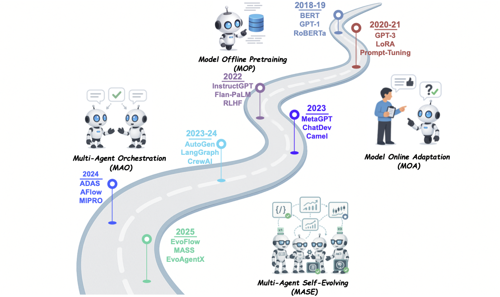
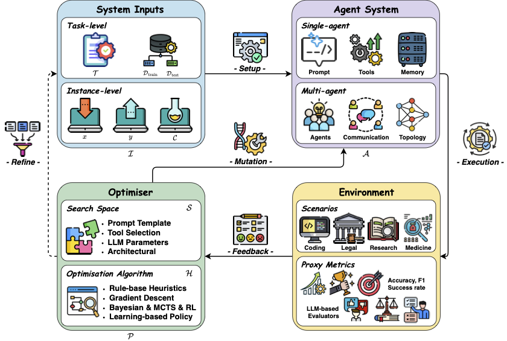

<h1 align="center">
  <strong>Awesome-Self-Evolving-Agents</strong>
</h1>

<h2 align="center">
  <strong>🤖 We're still cooking — Stay tuned! 🤖 ⭐ Give us a star if you like it! ⭐</strong>
</h2>

## AI Agents Development Path

  

## Conceptual Framework of the Self-evolving AI Agents

  

## Datasets, Benchmarks & Surveys
- (*ICLR'25*) Benchmarking Agentic Workflow Generation [[Paper](https://openreview.net/forum?id=vunPXOFmoi)]
- (*EMNLP'24*) FlowBench: Revisiting and Benchmarking Workflow-Guided Planning for LLM-Based Agents [[Paper](https://doi.org/10.18653/v1/2024.findings-emnlp.638)] [[Code](https://github.com/Justherozen/FlowBench)]

## Prompt Generation and Optimization
- (*EMNLP'24*) Optimizing Instructions and Demonstrations for Multi-Stage Language Model Programs [[Paper](https://doi.org/10.18653/v1/2024.emnlp-main.525)]

## Planning Generation and Optimization

## Memory Optimization

## Tool/Function Generation and Optimization
- (*ICLR'25*) Offline Training of Language Model Agents with Functions as Learnable Weights [[Paper](https://openreview.net/forum?id=2xbkWiEuR1)]
- (*Arxiv'25*) Darwin Gödel Machine: Open-Ended Evolution of Self-Improving Agents [[Paper](https://arxiv.org/pdf/2505.22954)]

## WorkFlow Generation and Optimization
- (*ICML'25*) Multi-Agent Architecture Search via Agentic Supernet [[Paper](https://doi.org/10.48550/arXiv.2502.04180)][[Code](https://github.com/bingreeky/MaAS)]
- (*ICLR'25*) AFlow: Automating Agentic Workflow Generation [[Paper](https://arxiv.org/abs/2410.10762)] [[Code](https://github.com/geekan/MetaGPT/tree/main/examples/aflow)]
- (*ICLR'25*) WorkflowLLM: Enhancing Workflow Orchestration Capability of Large Language Models [[Paper](https://openreview.net/forum?id=3Hy00Wvabi)]
- (*ICLR'25*) Flow: Modularized Agentic Workflow Automation [[Paper](https://openreview.net/forum?id=sLKDbuyq99)]
- (*ICLR'25*) Automated Design of Agentic Systems [[Paper](https://arxiv.org/abs/2408.08435)] [[Code](https://github.com/ShengranHu/ADAS)]
- (*Arxiv'25*) FlowReasoner: Reinforcing Query-Level Meta-Agents [[Paper](https://doi.org/10.48550/arXiv.2504.15257)]
- (*Arxiv'25*) AgentNet: Decentralized Evolutionary Coordination for LLM-Based Multi-Agent Systems [[Paper](https://arxiv.org/abs/2504.00587)]
- (*Arxiv'25*) MAS-GPT: Training LLMs to Build LLM-Based Multi-Agent Systems [[Paper](https://arxiv.org/abs/2503.03686)]
- (*Arxiv'25*) FlowAgent: Achieving Compliance and Flexibility for Workflow Agents [[Paper](https://doi.org/10.48550/arXiv.2502.14345)]
- (*Arxiv'25*) ScoreFlow: Mastering LLM Agent Workflows via Score-Based Preference Optimization [[Paper](https://arxiv.org/abs/2502.04306)] [[Code](https://github.com/Gen-Verse/ScoreFlow)]
- (*Arxiv'25*) Multi-Agent Design: Optimizing Agents with Better Prompts and Topologies [[Paper](https://arxiv.org/abs/2502.02533)]
- (*Arxiv'25*) MAS-ZERO: Designing Multi-Agent Systems with Zero Supervision [[Paper](https://arxiv.org/abs/2505.14996)]
- (*Arxiv'25*) MermaidFlow: Redefining Agentic Workflow Generation via Safety-Constrained Evolutionary Programming [[Paper](https://arxiv.org/abs/2505.22967)]
- (*ICML'24*) GPTSwarm: Language Agents as Optimizable Graphs [[Paper](https://arxiv.org/abs/2402.16823)] [[Code](https://github.com/metauto-ai/gptswarm)]
- (*ICLR'24*) DSPy: Compiling Declarative Language Model Calls into State-of-the-Art Pipelines [[Paper](https://openreview.net/forum?id=sY5N0zY5Od)] [[Code](https://github.com/stanfordnlp/dspy)]
- (*ICLR'24*) AgentVerse: Facilitating Multi-Agent Collaboration and Exploring Emergent Behaviors [[Paper](https://openreview.net/forum?id=EHg5GDnyq1)] [[Code](https://github.com/OpenBMB/AgentVerse)]
- (*ICLR'24*) MetaGPT: Meta Programming for a Multi-Agent Collaborative Framework [[Paper](https://openreview.net/forum?id=VtmBAGCN7o)] [[Code](https://github.com/geekan/MetaGPT)]
- (*COLM'24*) A Dynamic LLM-Powered Agent Network for Task-Oriented Agent Collaboration [[Paper](https://openreview.net/forum?id=XII0Wp1XA9)]
- (*COLM'24*) AutoGen: Enabling next-Gen LLM Applications via Multi-Agent Conversations [[Paper](https://openreview.net/forum?id=BAakY1hNKS)] [[Code](https://github.com/microsoft/autogen)]
- (*Arxiv'24*) G-Designer: Architecting Multi-Agent Communication Topologies via Graph Neural Networks [[Paper](https://doi.org/10.48550/arXiv.2410.11782)]
- (*Arxiv'24*) AutoFlow: Automated Workflow Generation for Large Language Model Agents [[Paper](https://arxiv.org/abs/2407.12821)] [[Code](https://github.com/agiresearch/AutoFlow)]
- (*Arxiv'24*) Symbolic Learning Enables Self-Evolving Agents [[Paper](https://arxiv.org/abs/2406.18532)] [[Code](https://github.com/aiwaves-cn/agents)]
- (*Arxiv'24*) Adaptive In-Conversation Team Building for Language Model Agents [[Paper](https://arxiv.org/abs/2405.19425)]

## Application
- (*ICLR'25*) MDAgents: An Adaptive Collaboration of LLMs for Medical Decision-Making [[Paper](https://openreview.net/forum?id=EKdk4vxKO4)]
- (*Arxiv'25*) A Self-Improving Coding Agent [[Paper](https://arxiv.org/abs/2504.15228)]
- (*Arxiv'25*) Self-Evolving Agentic Workflows for Automated Code Generation [[Paper](https://arxiv.org/abs/2505.18646)]