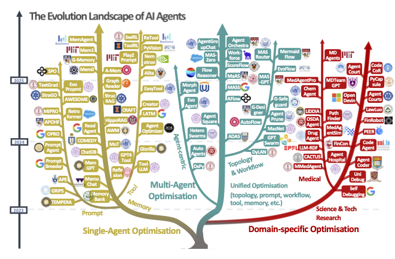

<!-- <h1 align="center">
  <strong>A Comprehensive Survey of Self-Evolving AI Agents<br>A New Paradigm Bridging Foundation Models and Lifelong Agentic Systems</strong>
</h1> -->

<h1 align="center">
  <strong>Awesome-Self-Evolving-Agents</strong>
</h1>
<div align="center">


[](https://awesome.re)
[](https://arxiv.org/abs/2508.07407)
[](https://github.com/EvoAgentX/Awesome-Self-Evolving-Agents/pulls)
[](LICENSE)

<h3 align="center">
  <strong>🤖 We're still cooking — Stay tuned! 🤖<br>⭐ Give us a star if you like it! ⭐</strong>
</h3>


<br>
<em>Figure: A visual taxonomy of AI agent evolution and optimisation techniques, categorised into three major directions: single-agent optimisation, multi-agent optimisation, and domain-specific optimisation. The tree structure illustrates the development of these approaches from 2023 to 2025, including representative methods within each branch.</em>

</div>

## AI Agents Development Path

<p align="center">
  
</p>

## Conceptual Framework of the Self-evolving AI Agents
<p align="center">
  
</p>

## Single-Agent Optimisation 

### LLM Behaviour Optimisation 
- (*NeurIPS'22*) STaR : Bootstrapping reasoning with reasoning [[Paper](https://arxiv.org/abs/2203.14465)] [[Code](https://github.com/ezelikman/STaR)]
- (*ICLR'23*) Self-consistency improves chain of thought reasoning in language models [[Paper](https://arxiv.org/abs/2203.11171)]
- (**NeurIPS'23*) Tree of thoughts: Deliberate problem solving with large language models [[Paper](https://arxiv.org/abs/2305.10601)] [[Code](https://github.com/princeton-nlp/tree-of-thought-llm)]
- (*ESEC/FSE'23*) Baldur: Whole-Proof Generation and Repair with Large Language Models [[Paper](https://arxiv.org/abs/2303.04910)]
- (*ICLR'24*) ToRA: A tool-integrated reasoning agent for mathematical problem solving [[Paper](https://arxiv.org/abs/2309.17452)] [[Code](https://github.com/microsoft/ToRA)]
- (*Arxiv'24*) NExT: Teaching large language models to reason about code execution [[Paper](https://arxiv.org/abs/2404.14662)]
- (*ICML'24)Self-rewarding language models [[Paper](https://arxiv.org/abs/2401.10020)] [[Code](https://github.com/lucidrains/self-rewarding-lm-pytorch)]
- (*Arxiv'24*) Absolute Zero: Reinforced self-play reasoning with zero data [[Paper](https://arxiv.org/abs/2505.03335)]
- (*ACL'24*) Math-shepherd: Verify and reinforce llms step-by-step without human annotations [[Paper](https://arxiv.org/abs/2312.08935)]
- (*AAAI'24*) Graph of thoughts: Solving elaborate problems with large language models [[Paper](https://arxiv.org/abs/2308.09687)] [[Code](https://github.com/spcl/graph-of-thoughts)]
- (*ICLR'25*) Rewarding progress: Scaling automated process verifiers for LLM reasoning [[Paper](https://arxiv.org/abs/2410.08146)]

### Prompt Optimisation
- (*EACL'23*) GrIPS: Gradient-free, Edit-based Instruction Search for Prompting Large Language Models [[Paper](https://arxiv.org/abs/2203.07281)]
- (*ICLR'23*) TEMPERA: Test-Time Prompting via Reinforcement Learning [[Paper](https://arxiv.org/abs/2211.11890)] [[Code](https://github.com/tianjunz/TEMPERA)]
- (*EMNLP'23*) Automatic Prompt Optimization with "Gradient Descent" and Beam Search [[Paper](https://arxiv.org/abs/2305.03495)] 
- (*EMNLP'24*) Optimizing Instructions and Demonstrations for Multi-Stage Language Model Programs [[Paper](https://doi.org/10.18653/v1/2024.emnlp-main.525)]
- (*EMNLP'24*) GPS: Genetic Prompt Search for Efficient Few-shot Learning [[Paper](https://arxiv.org/abs/2210.17041)] [[Code](https://github.com/hwxu20/GPS)]
- (*ICLR'23*) Large Language Models Are Human-Level Prompt Engineers [[Paper](https://arxiv.org/abs/2211.01910)] [[Code](https://github.com/keirp/automatic_prompt_engineer)]
- (*ICLR'24*) PromptAgent: Strategic Planning with Language Models Enables Expert-level Prompt Optimization [[Paper](https://arxiv.org/abs/2310.16427)] [[Code](https://github.com/XinyuanWangCS/PromptAgent)] 
- (*ICLR'24*) Large Language Models as Optimizers [[Paper](https://arxiv.org/abs/2309.03409)] [[Code](https://github.com/google-deepmind/opro)]
- (*ICLR'24*) Retroformer: Retrospective Large Language Agents with Policy Gradient Optimization [[Paper](https://arxiv.org/abs/2308.02151)] [[Code](https://github.com/weirayao/Retroformer)]
- (*ICLR'24*) EvoPrompt: Connecting LLMs with Evolutionary Algorithms Yields Powerful Prompt Optimizers [[Paper](https://arxiv.org/abs/2309.08532)] [[Code](https://github.com/beeevita/EvoPrompt)]
- (*ICML'24*) Promptbreeder: Self-Referential Self-Improvement Via Prompt Evolution [[Paper](https://arxiv.org/abs/2309.16797)]
- (*Arxiv'24*) Prompt Optimization with Human Feedback [[Paper](https://arxiv.org/abs/2405.17346)] [[Code](https://github.com/xqlin98/APOHF)]
- (*Arxiv'24*) StraGo: Harnessing Strategic Guidance for Prompt Optimization [[Paper](https://arxiv.org/abs/2410.08601)]
- (*Arxiv'24*) TextGrad: Automatic "Differentiation" via Text [[Paper](https://arxiv.org/abs/2406.07496)] 
- (*Arxiv'25*) Self-Supervised Prompt Optimization [[Paper](https://arxiv.org/abs/2502.06855)] 

### Memory Optimization
- (*ICML'24*) A Human-Inspired Reading Agent with Gist Memory of Very Long Contexts [[Paper](https://arxiv.org/abs/2402.09727)]
- (*ICML'24*) Agent Workflow Memory [[Paper](https://arxiv.org/abs/2409.07429)] 
- (*AAAI'24*) MemoryBank: Enhancing Large Language Models with Long-Term Memory [[Paper](https://arxiv.org/abs/2305.10250)]
- (*EMNLP'24*) GraphReader: Building graph-based agent to enhance long-context [[Paper](https://arxiv.org/abs/2406.14550)]
- (*Arxiv'24*) "My agent understands me better": Integrating Dynamic Human-like Memory Recall and Consolidation in LLM-Based Agents [[Paper](https://arxiv.org/abs/2404.00573)] 
- (*ICLR'25*) Compress to Impress: Unleashing the Potential of Compressive Memory in Real-World Long-Term Conversations [[Paper](https://arxiv.org/abs/2402.11975)]
- (*ICLR'25*) Boosting knowledge intensive reasoning of llms via inference-time hybrid information [[Paper](https://arxiv.org/abs/2410.08815)] [[Code](https://github.com/icip-cas/StructRAG)]
- (*ACL'25*) Improving factuality with explicit working memory [[Paper](https://arxiv.org/abs/2412.18069)]
- (*Arxiv'25*) A-MEM: Agentic Memory for LLM Agents [[Paper](https://arxiv.org/abs/2502.12110)]
- (*Arxiv'25*) Mem0: Building Production-Ready AI Agents with Scalable Long-Term Memory [[Paper](https://arxiv.org/abs/2504.19413)] 

### Tool Optimization
- (*EMNLP'23*) CREATOR : Tool creation for disentangling abstract and concrete reasoning of large language model [[Paper](https://arxiv.org/abs/2305.14318)] 
- (*ICLR'24*) ToolLLM: Facilitating Large Language Models to Master 16000+ Real-world APIs [[Paper](https://arxiv.org/abs/2307.16789)]
- (*ICML'24*) Offline Training of Language Model Agents with Functions as Learnable Weights [[Paper](https://arxiv.org/abs/2402.11359)] 
- (*AAAI'24*)  Iterative tool learning from introspection feedback by easy-to-difficult curriculum [[Paper](https://arxiv.org/abs/2308.14034)] 
- (*ICLR'25*) Offline Training of Language Model Agents with Functions as Learnable Weights [[Paper](https://openreview.net/forum?id=2xbkWiEuR1)]
- (*Arxiv'25*) Darwin Gödel Machine: Open-Ended Evolution of Self-Improving Agents [[Paper](https://arxiv.org/pdf/2505.22954)]
- (*Arxiv'25*) ReTool: Reinforcement Learning for Strategic Tool Use in LLMs [[Paper](https://arxiv.org/abs/2504.11536)]
- (*Arxiv'25*) ToolRL: Reward is All Tool Learning Needs [[Paper](https://arxiv.org/abs/2504.13958)]
- (*Arxiv'25*) Alita: Generalist Agent Enabling Scalable Agentic Reasoning with Minimal Predefinition and Maximal Self-Evolution [[Paper](https://arxiv.org/abs/2505.20286)] 

## Multi-Agent Optimisation 
- (*ICML'25*) Multi-Agent Architecture Search via Agentic Supernet [[Paper](https://doi.org/10.48550/arXiv.2502.04180)][[Code](https://github.com/bingreeky/MaAS)]
- (*ICLR'25*) AFlow: Automating Agentic Workflow Generation [[Paper](https://arxiv.org/abs/2410.10762)] [[Code](https://github.com/geekan/MetaGPT/tree/main/examples/aflow)]
- (*ICLR'25*) WorkflowLLM: Enhancing Workflow Orchestration Capability of Large Language Models [[Paper](https://openreview.net/forum?id=3Hy00Wvabi)]
- (*ICLR'25*) Flow: Modularized Agentic Workflow Automation [[Paper](https://openreview.net/forum?id=sLKDbuyq99)]
- (*ICLR'25*) Automated Design of Agentic Systems [[Paper](https://arxiv.org/abs/2408.08435)] [[Code](https://github.com/ShengranHu/ADAS)]
- (*Arxiv'25*) FlowReasoner: Reinforcing Query-Level Meta-Agents [[Paper](https://doi.org/10.48550/arXiv.2504.15257)]
- (*Arxiv'25*) AgentNet: Decentralized Evolutionary Coordination for LLM-Based Multi-Agent Systems [[Paper](https://arxiv.org/abs/2504.00587)]
- (*Arxiv'25*) MAS-GPT: Training LLMs to Build LLM-Based Multi-Agent Systems [[Paper](https://arxiv.org/abs/2503.03686)]
- (*Arxiv'25*) FlowAgent: Achieving Compliance and Flexibility for Workflow Agents [[Paper](https://doi.org/10.48550/arXiv.2502.14345)]
- (*Arxiv'25*) ScoreFlow: Mastering LLM Agent Workflows via Score-Based Preference Optimization [[Paper](https://arxiv.org/abs/2502.04306)] [[Code](https://github.com/Gen-Verse/ScoreFlow)]
- (*Arxiv'25*) Multi-Agent Design: Optimizing Agents with Better Prompts and Topologies [[Paper](https://arxiv.org/abs/2502.02533)]
- (*Arxiv'25*) MAS-ZERO: Designing Multi-Agent Systems with Zero Supervision [[Paper](https://arxiv.org/abs/2505.14996)]
- (*Arxiv'25*) MermaidFlow: Redefining Agentic Workflow Generation via Safety-Constrained Evolutionary Programming [[Paper](https://arxiv.org/abs/2505.22967)]
- (*ICML'24*) GPTSwarm: Language Agents as Optimizable Graphs [[Paper](https://arxiv.org/abs/2402.16823)] [[Code](https://github.com/metauto-ai/gptswarm)]
- (*ICLR'24*) DSPy: Compiling Declarative Language Model Calls into State-of-the-Art Pipelines [[Paper](https://openreview.net/forum?id=sY5N0zY5Od)] [[Code](https://github.com/stanfordnlp/dspy)]
- (*ICLR'24*) AgentVerse: Facilitating Multi-Agent Collaboration and Exploring Emergent Behaviors [[Paper](https://openreview.net/forum?id=EHg5GDnyq1)] [[Code](https://github.com/OpenBMB/AgentVerse)]
- (*ICLR'24*) MetaGPT: Meta Programming for a Multi-Agent Collaborative Framework [[Paper](https://openreview.net/forum?id=VtmBAGCN7o)] [[Code](https://github.com/geekan/MetaGPT)]
- (*COLM'24*) A Dynamic LLM-Powered Agent Network for Task-Oriented Agent Collaboration [[Paper](https://openreview.net/forum?id=XII0Wp1XA9)]
- (*COLM'24*) AutoGen: Enabling next-Gen LLM Applications via Multi-Agent Conversations [[Paper](https://openreview.net/forum?id=BAakY1hNKS)] [[Code](https://github.com/microsoft/autogen)]
- (*Arxiv'24*) G-Designer: Architecting Multi-Agent Communication Topologies via Graph Neural Networks [[Paper](https://doi.org/10.48550/arXiv.2410.11782)]
- (*Arxiv'24*) AutoFlow: Automated Workflow Generation for Large Language Model Agents [[Paper](https://arxiv.org/abs/2407.12821)] [[Code](https://github.com/agiresearch/AutoFlow)]
- (*Arxiv'24*) Symbolic Learning Enables Self-Evolving Agents [[Paper](https://arxiv.org/abs/2406.18532)] [[Code](https://github.com/aiwaves-cn/agents)]
- (*Arxiv'24*) Adaptive In-Conversation Team Building for Language Model Agents [[Paper](https://arxiv.org/abs/2405.19425)]

## Evaluation
### LLM-as-a-Judge

- (*arXiv'24*) **Towards Better Human-Agent Alignment: Assessing Task Utility in LLM-Powered Applications** — Arabzadeh et al. [[Paper\]](https://arxiv.org/abs/2402.09015) [arXiv](https://arxiv.org/abs/2402.09015)
- (*arXiv'24*) **LLMs-as-Judges: A Comprehensive Survey on LLM-based Evaluation Methods** — Li et al. [[Paper\]](https://arxiv.org/abs/2412.05579) [arXiv](https://arxiv.org/abs/2412.05579)
- (*2025*) **Enhancing LLM-as-a-Judge via Multi-Agent Collaboration (CollabEval)** — Qian et al. [Paper] [Overview] [multiagents.org](https://multiagents.org/2025_artifacts/agentseval_enhancing_llm_as_a_judge_via_multi_agent_collaboration.pdf)[Amazon Science](https://www.amazon.science/publications/enhancing-llm-as-a-judge-via-multi-agent-collaboration)
- (*arXiv'24*) **LiveIdeaBench: Evaluating LLMs’ Divergent Thinking for Scientific Idea Generation with Minimal Context** — Ruan et al. [[Paper\]](https://arxiv.org/abs/2412.17596) [arXiv](https://arxiv.org/abs/2412.17596)
- (*arXiv'24*) **Auto-Arena: Automating LLM Evaluations with Agent Peer Debate and Committee Voting** — Zhao et al. [[Paper\]](https://arxiv.org/abs/2405.20267) [arXiv](https://arxiv.org/abs/2405.20267)
- (*arXiv'25*) **MCTS-Judge: Test-Time Scaling in LLM-as-a-Judge for Code Correctness Evaluation** — Wang et al. [[Paper\]](https://arxiv.org/abs/2502.12468) [arXiv](https://arxiv.org/abs/2502.12468)

### Agent-as-a-Judge

- (*arXiv'24*) **Agent-as-a-Judge: Evaluate Agents with Agents** — Zhuge et al. [[Paper\]](https://arxiv.org/abs/2410.10934) [arXiv](https://arxiv.org/abs/2410.10934)

### Safety, Alignment, and Robustness for Lifelong / Self-Evolving Agents

- (*arXiv'24*) **AgentHarm: A Benchmark for Measuring Harmfulness of LLM Agents** — Andriushchenko et al. [[Paper\]](https://arxiv.org/abs/2410.09024) [arXiv](https://arxiv.org/abs/2410.09024)
- (*NeurIPS'24 – Datasets & Benchmarks*) **RedCode: Risky Code Execution and Generation** — Guo et al. [[Paper\]](https://arxiv.org/abs/2411.07781) [arXiv](https://arxiv.org/abs/2411.07781)
- (*arXiv'24*) **MobileSafetyBench: Evaluating Safety of Autonomous Agents in Mobile Device Control** — Lee et al. [[Paper\]](https://arxiv.org/abs/2410.17520) [Site] [arXiv](https://arxiv.org/abs/2410.17520)[mobilesafetybench.github.io](https://mobilesafetybench.github.io/)
- (*arXiv'23*) **Do the Rewards Justify the Means? Measuring Trade-Offs Between Rewards and Ethical Behavior in the MACHIAVELLI Benchmark** — Pan et al. [[Paper\]](https://arxiv.org/abs/2304.03279) [arXiv](https://arxiv.org/abs/2304.03279)
- (*arXiv'24*) **R-Judge: Benchmarking Safety Risk Awareness for LLM Judges** — Yuan et al. [[Paper\]](https://arxiv.org/abs/2401.10019) [Site] [arXiv](https://arxiv.org/abs/2401.10019)[rjudgebench.github.io](https://rjudgebench.github.io/)
- (*Findings of ACL'25*) **SafeLawBench: Towards Safe Alignment of Large Language Models** — Cao et al. [[Paper\]](https://arxiv.org/abs/2506.06636) [arXiv](https://arxiv.org/abs/2506.06636)


## 📚 Citation

If you find this survey useful in your research and applications, please cite using this BibTeX:

```
@misc{fang2025comprehensivesurveyselfevolvingai,
      title={A Comprehensive Survey of Self-Evolving AI Agents: A New Paradigm Bridging Foundation Models and Lifelong Agentic Systems}, 
      author={Jinyuan Fang and Yanwen Peng and Xi Zhang and Yingxu Wang and Xinhao Yi and Guibin Zhang and Yi Xu and Bin Wu and Siwei Liu and Zihao Li and Zhaochun Ren and Nikos Aletras and Xi Wang and Han Zhou and Zaiqiao Meng},
      year={2025},
      eprint={2508.07407},
      archivePrefix={arXiv},
      primaryClass={cs.AI},
      url={https://arxiv.org/abs/2508.07407}, 
}
```

## ☕ Acknowledgement

We would like to thank Shuyu Guo for his valuable contributions to the early-stage exploration and literature
review on agent optimisation.

## ✉️ Contact Us

If you have any questions or suggestions, please feel free to contact us via:

Email: j.fang.2@research.gla.ac.uk and Zaiqiao.Meng@glasgow.ac.uk